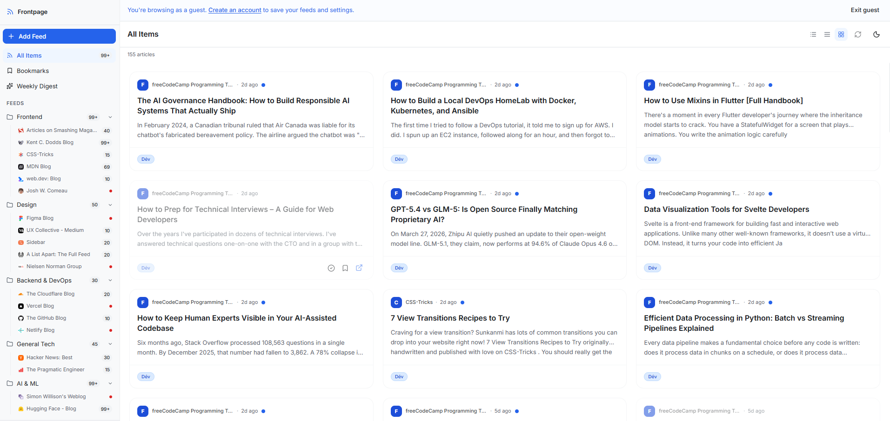

# Frontpage — Thomas ROBERT

A customizable content aggregator that pulls RSS and Atom feeds into one well-designed reading dashboard.

**Live URL:** https://frontpage-toco.vercel.app/



---

## Overview

Frontpage is a full-stack RSS/Atom feed reader built as a Frontend Mentor Product Challenge. It fetches, parses and stores articles from any public feed URL, organises them into user-defined categories, and presents them in three switchable layouts (list, compact, cards). A guest demo lets visitors explore 19 curated tech feeds without signing up. Authenticated users get a persistent reading history, bookmarks, and an AI-powered weekly digest.

### Tech Stack

| Layer          | Technology                             |
| -------------- | -------------------------------------- |
| Framework      | TanStack Start v1 (React 19, SSR)      |
| Routing        | TanStack Router v1 (file-based)        |
| Database       | Drizzle ORM + Neon (PostgreSQL)        |
| Authentication | Better Auth v1.5                       |
| Hosting        | Nitro (nightly) / Vercel               |
| Styling        | Tailwind CSS v4 + shadcn/ui (new-york) |
| Feed parsing   | fast-xml-parser                        |
| Type checking  | TypeScript 5.7 (strict)                |
| AI             | Google Gemini 2.5 Flash (free tier)    |

---

## Phase 7 — AI Features

Powered by **Google Gemini 1.5 Flash** via `@google/generative-ai`. All AI features degrade gracefully when `GEMINI_API_KEY` is not set — the UI simply hides the AI affordances.

### Article Summarization

Open any article in the Reader View drawer and click **"Summarize with AI"** to generate a 2–3 sentence summary. Summaries are stored in the `feedItem.aiSummary` column, so subsequent opens return the cached result instantly (no second API call).

### Category Auto-Suggestion

When adding a new feed, Frontpage calls Gemini in the background after the feed preview loads. If it finds a good match among your existing categories, a dismissible suggestion banner appears above the Category selector with an **Apply** button. This fires without blocking the UI — if it fails or finds no match, nothing is shown.

### Weekly Digest View

Navigate to **Weekly Digest** in the sidebar (or `?view=digest`) to see an AI-curated editorial briefing of your unread articles from the last 7 days. The view:

1. Queries the 10 most recent unread items with content (last 7 days).
2. Sends them to Gemini for a 3–4 sentence editorial summary.
3. Lists the individual articles below, showing AI summaries where already cached.

### Caching Strategy

`feedItem.aiSummary` stores generated summaries in Postgres. `generateSummaryFn` checks for an existing value before calling Gemini, so summaries are only generated once per article regardless of how many times the reader is opened.

### Graceful Fallback

- If `GEMINI_API_KEY` is missing or the API call fails, `generateSummaryFn` returns `{ summary: null, error: 'AI unavailable' }` — the UI shows a gentle error message.
- `suggestCategoryFn` returns `null` on any error — the suggestion banner simply never appears.
- `getWeeklyDigestFn` re-throws on error — the Digest view shows an error state with a retry button.

---

## Design Decisions

These are the product and design choices I made where the spec left room for interpretation.

### Content Discovery & Onboarding

**The problem I was solving:** A feed reader is useless when empty. New users need to get to "valuable content in the app" within seconds, not minutes.

**My approach:** Two parallel onboarding paths. First, a guest demo with 19 curated tech/design/dev feeds pre-loaded (seeded via a one-time script), so anyone visiting the landing page can click "Try as guest" and land in a fully populated dashboard instantly. Second, for authenticated users who start fresh, a "Starter Pack" onboarding flow in the empty state offers to add all 19 curated feeds in one click, with manual category assignment in a follow-up dialog.

**Why I chose this approach:** The guest path eliminates the "blank page" problem for discovery. The starter pack removes the friction of searching for good feed URLs — the hardest part of adopting an RSS reader.

**What I'd do differently:** Add OPML import for power users migrating from another reader. The data model already supports it.

### Digest / Summary View

**The problem I was solving:** Readers who don't check in daily need a "what did I miss?" view that surfaces signal without overwhelming them with 100+ unread items.

**My approach:** A Weekly Digest view (sidebar link or `?view=digest`) queries the 10 most recent unread articles from the past 7 days that have full content, sends them to Gemini for a 3–4 sentence editorial briefing, and displays that briefing above the list of articles. Article-level AI summaries are shown inline where already cached.

**Why I chose this approach:** An editorially-framed briefing feels more like a newsletter than a raw list — it gives context for why these items matter together. The view degrades gracefully: if AI is unavailable, the articles are still shown without a briefing.

**What I'd do differently:** Let users tune the digest (e.g. filter by category, adjust the look-back window). Currently it's one fixed view.

### Layout Customization

Three layout modes — list, compact, and cards — let readers choose their preferred density. The toggle lives in the page header so it's always accessible without digging into settings.

**The problem I was solving:** Different reading contexts call for different densities. Skimming headlines at speed needs compact; deep reading needs list with excerpts; visual/magazine content needs cards.

**My approach:** A three-button toggle group (icon-only, with tooltips) that persists the preference to localStorage. The selected layout affects how feed items are rendered but not the URL, so bookmarks and shares always show content in the viewer's preferred format.

**Why I chose this approach:** Keeping layout state in localStorage (not search params) means it's truly personal — your layout preference doesn't affect shared links.

**What I'd do differently:** Add a per-feed layout override for feeds that are inherently visual (always show cards for image-heavy feeds).

### Other Design Choices

**Card click → Reader View.** Clicking a card title opens the in-app reader drawer (when full article HTML is available) rather than jumping straight to the external URL. The reader shows sanitised content (via `isomorphic-dompurify`), an AI summary button, and an "Original article ↗" link for when you want to go to the source. External links remain accessible via the action bar's `ExternalLink` icon without opening the reader.

**Unread/Bookmark state model.** Unread count and bookmark count are both reflected live in the sidebar without a full page reload. Toggling a bookmark or marking items as read triggers a sidebar data refresh so counters stay accurate. Read items fade to 60% opacity; unread items have a blue dot indicator.

**Health indicators.** Each feed in the sidebar has a subtle colour-coded health badge (green / yellow / red) showing whether the last fetch succeeded. On error, the feed detail view shows the specific error message and a manual retry button.

---

## Development Journey

### Initial Approach vs. Final

<!-- What was your initial plan? What changed as you built? Were there any pivots? -->

### Decisions Reconsidered

<!-- What seemed right at first but needed rethinking? Why did you change course? -->

### What Surprised Me

<!-- What was harder than expected? Easier? What didn't you anticipate? -->

### Session Breakdown

<!-- How did you structure your working sessions? What did you accomplish in each? Add rows for however many sessions you worked across. -->

| Session | Focus | What I Accomplished |
| ------- | ----- | ------------------- |
| 1       |       |                     |
| 2       |       |                     |
| 3       |       |                     |

---

## AI Collaboration Reflection

<!-- This section documents how you worked with AI throughout the project. -->

### How I Used AI

<!-- What was AI most helpful for? Where did you rely on your own judgment? -->

### What Worked Well

<!-- Which prompting strategies or collaboration patterns produced the best results? -->

### What I Learned

<!-- How did your approach to AI collaboration evolve across sessions? What would you do differently next time? -->

### Where I Pushed Back

<!-- Were there moments where AI suggestions weren't right? How did you identify and correct course? -->

---

## Differentiators

### Chosen Differentiator(s)

**1. AI-Powered Content Intelligence (Gemini 2.5 Flash)**

**Why I chose this:** AI summarisation directly addresses the core pain point of an RSS reader — information overload. Instead of adding a cosmetic feature, AI here does real work: it saves reading time.

**How it enhances the product:**

- **Article summaries** cached in the database so the first reader who summarises an article benefits everyone (no repeat API calls).
- **Category auto-suggestion** on feed add reduces the friction of organisation — Gemini reads the feed title/description and suggests the best matching category from the user's own list.
- **Weekly Digest** surfaces a curated editorial briefing of the week's most recent unread content, giving irregular readers a meaningful entry point.

**Implementation highlights:**

- All AI calls are non-blocking: summaries and suggestions degrade gracefully to `null` — the UI never crashes or blocks on AI.
- 429 quota errors are caught and surfaced with a human-readable "Retry in Xs" countdown that auto-enables the button.
- Model: `gemini-2.5-flash` via the free tier on AI Studio. Using `@google/generative-ai` SDK directly (no wrapper library).

**What I learned:** Gemini's free tier is tied to the API key source — keys from Google Cloud Console (billing-enabled projects) have a free quota of zero. Keys from [aistudio.google.com](https://aistudio.google.com) work correctly on the free tier.

---

## Self-Assessment

Rate your implementation honestly. This self-awareness is part of the portfolio artifact.

| Category                                                                                                 | Rating | Notes |
| -------------------------------------------------------------------------------------------------------- | ------ | ----- |
| **Works for real users** — Deployed, functional end-to-end                                               | /5     |       |
| **Feed parsing robustness** — Handles format variations, errors, edge cases                              | /5     |       |
| **Design-it-yourself features** — Quality and thoughtfulness of onboarding, digest, and layout solutions | /5     |       |
| **Design quality** — Typography, spacing, visual hierarchy, polish                                       | /5     |       |
| **Responsive design** — Fully functional and well-designed across devices                                | /5     |       |
| **Performance** — Fast load, smooth scrolling, efficient caching                                         | /5     |       |
| **Accessibility** — Keyboard nav, screen reader support, contrast                                        | /5     |       |
| **Edge case handling** — Empty states, errors, loading, large datasets                                   | /5     |       |
| **Code quality** — Clean, maintainable, well-structured                                                  | /5     |       |
| **Landing page** — Compelling, communicates value, visually polished                                     | /5     |       |
| **Guest experience** — Immediately impressive, real content, full features                               | /5     |       |

### Lighthouse Scores

<!-- Run Lighthouse on your deployed site and record the scores -->

| Category       | Score |
| -------------- | ----- |
| Performance    | 91    |
| Accessibility  | 93    |
| Best Practices | 96    |
| SEO            | 100   |

### Strengths

<!-- What are you most proud of in this project? -->

### Areas for Improvement

<!-- What would you improve with more time? Be specific. -->

---

## Known Limitations

- **No background feed refresh** — feeds are only refreshed when a user manually clicks "Refresh" or adds a new feed. There is no scheduled cron job. On Vercel's free tier, a cron would require a separate Vercel Cron configuration.
- **Search not implemented** — full-text search across articles is a stretch feature. The DB schema supports it (PostgreSQL `tsvector`) but the UI is not built.
- **OPML import/export missing** — power users migrating from other readers cannot bulk-import their subscriptions. The data model supports it.
- **Guest state is read-only** — the guest demo user's read/bookmark state is seeded and not writeable (changes would be visible to all guests sharing the demo account).
- **AI quota dependence** — Gemini 2.5 Flash on the free tier has per-minute and per-day limits. Heavy usage will hit 429 errors; the app handles them gracefully but AI features become temporarily unavailable.
- **No password reset flow** — Better Auth supports it, but email delivery (via Resend or similar) was not configured for this MVP.

---

## Guest Demo Setup

Run the seed script once to create the demo account used for the "Try as guest" experience:

```bash
pnpm seed
```

Copy the output `GUEST_DEMO_USER_ID=xxx` and add it to your `.env` file.

---

## Running Locally

```bash
# Clone the repo
git clone [your-repo-url]
cd frontpage

# Install dependencies
pnpm install

# Set up environment variables
cp .env.example .env
# Fill in your database URL and auth secret

# Push the database schema
pnpm drizzle-kit push

# Run the development server
pnpm dev
```

### Environment Variables

| Variable             | Description                                                                                                         |
| -------------------- | ------------------------------------------------------------------------------------------------------------------- |
| `DATABASE_URL`       | Neon PostgreSQL connection string (pooled, with `?sslmode=require`)                                                 |
| `BETTER_AUTH_SECRET` | Random secret for session signing (min 32 chars, e.g. `openssl rand -base64 32`)                                    |
| `GEMINI_API_KEY`     | Google AI Studio API key — get one at [aistudio.google.com](https://aistudio.google.com) (not Google Cloud Console) |
| `GUEST_DEMO_USER_ID` | UUID of the seeded demo user — output by `pnpm seed`                                                                |

---

## Acknowledgments

Built as a [Frontend Mentor Product Challenge](https://www.frontendmentor.io).
